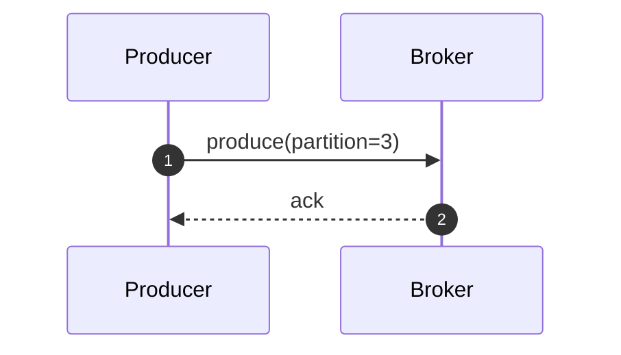
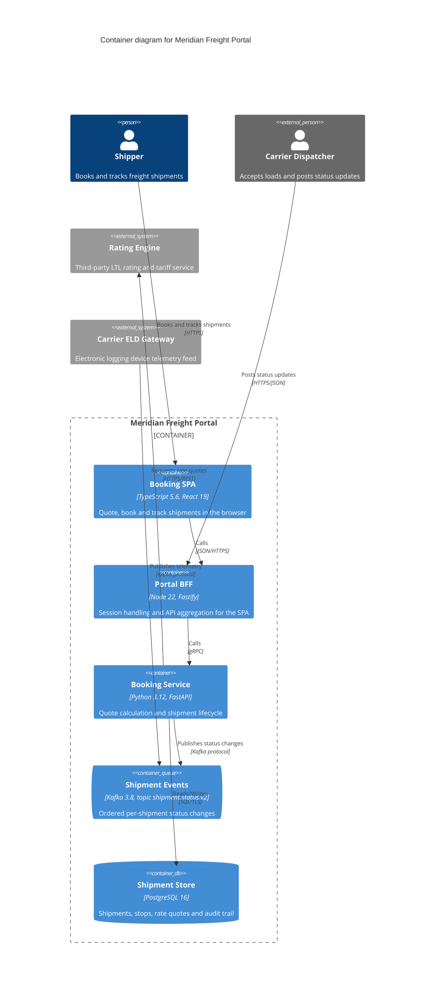

# Position 06 — Diagrams as first-class, versioned, diffable artifacts

**Role:** Diagram specialist (C4 / Mermaid)
**Scope:** diagram source format, render mode, source/render drift, C4 level addressing and linking, diagram frontmatter, embedded-vs-standalone, accessibility and findability.
**Status:** position paper for panel synthesis. Every empirical claim below was measured on this machine on 2026-08-14; commands and outputs are quoted inline.

---

## 0. Executive position in six lines

1. **Mermaid is the only sanctioned diagram source format.** Not because it is the best C4 tool — it isn't — but because it is the only one that needs zero toolchain, renders natively on github.com, and that LLMs emit correctly.
2. **Mermaid's native `C4Context`/`C4Container` grammar works.** I tested it. Use it for C4. Its *layout* is the weak part, not its parser.
3. **Rendered output is build output. It is never committed.** This is the exact same answer the panel already accepted for markdown→HTML, and it dissolves diagram drift by construction rather than policing it.
4. **Render mode: prerender to static SVG in CI, with automatic client-side fallback.** Same source, same page contract, two render paths, zero committed artifacts.
5. **C4 levels are joined by a `subject_system` slug plus upward-only `c4_parent` pointers.** Children are derived by the build, never hand-listed.
6. **A diagram that ships without prose is invisible.** Required `alt` + required narrative section is the single highest-value rule in this document, because half the readership can only grep text.

---

## 1. Diagram source format

### 1.1 What I actually measured

Environment: Node 22.23.2, npm 10.9.8, Python 3.12.3, `mermaid@11.16.1`.

I installed Mermaid 11 and ran its real parser (`mermaid.parse()`) under jsdom against ten diagram sources — canonical C4, LLM-typical mistakes, and a flowchart baseline. Results:

| # | Case | Result |
|---|---|---|
| A | `C4Container` canonical, with `Container_Boundary { }`, `ContainerDb`, `UpdateRelStyle` | **PASS** |
| B | `C4Context` with `System_Boundary { }`, `SystemDb` | **PASS** |
| C | `C4Container` + C4-PlantUML `!include https://.../C4_Container.puml` | **FAIL** — `Lexical error on line 2` |
| D | `@startuml` / `@enduml` wrapper around C4 body | **FAIL** — `Lexical error on line 1` |
| E | `LAYOUT_WITH_LEGEND()` | **FAIL** — `Lexical error on line 2` |
| F | `Rel_D(...)` / `Rel_R(...)` directional variants | **PASS** |
| G | Arity-short `Person(id,"Label")`, `Container(id,"Label","Tech")` | **PASS** |
| H | `flowchart TB` styled as C4 (subgraph + classDef) | **PASS** |
| I | `sequenceDiagram` baseline | **PASS** |
| J | `flowchart` with unquoted parens: `a[Web App (Java)]` | **FAIL** — `Parse error on line 2` |

Two things fall straight out of this table.

**Mermaid's C4 grammar is real and it is forgiving.** Optional trailing arguments work (case G), directional relationship variants work (case F), boundary brace blocks work (A, B). The common panel assumption that "Mermaid C4 is experimental therefore unusable" is wrong. It is experimental in *layout quality*, not in parseability.

**The LLM failure modes are specific, predictable, and detectable.** Cases C, D and E are the same underlying error: C4-PlantUML and Mermaid C4 use *identical macro names* (`Person`, `Container`, `System_Ext`, `Rel`), because Mermaid deliberately borrowed them. A model that has seen far more C4-PlantUML than Mermaid C4 in training therefore produces a correct-looking body wrapped in PlantUML ceremony — the `!include` of the C4 stdlib, `@startuml`, `LAYOUT_WITH_LEGEND()`. The body is fine; the frame is fatal. Case J is the other evergreen: unquoted `(`/`[`/`{` inside flowchart node labels.

This is good news for governance: **all four failures are single-line, mechanically detectable, and mechanically fixable.** The validator should not merely reject them, it should say which line to delete. See §8.

Note also case C's second problem: the canonical C4-PlantUML form *requires* fetching `C4_Container.puml` from raw.githubusercontent.com at render time. That is an external runtime dependency during build, and it is exactly the class of thing the hard requirements forbid. C4-PlantUML is disqualified twice over.

### 1.2 The candidates, scored honestly

Criteria weighted for this repo: **LLM first-try correctness** (six uncoordinated tools, no human in the loop), **GitHub-native rendering** (the graceful-degradation principle), **toolchain weight**, **diffability**, **rot resistance**.

**Mermaid.** LLM correctness: highest of any diagram syntax, by a wide margin, for `flowchart`, `sequenceDiagram`, `erDiagram`, `classDiagram`, `stateDiagram-v2`. These are the shapes models emit most reliably of any diagram notation in existence — it is the default "draw me a diagram" target and the training corpus is enormous. For `C4Container` specifically, correctness is *good but not top-tier*: the body is nearly always right, the PlantUML-frame contamination of cases C/D/E is the dominant failure and it is trivially linted. GitHub renders ```mermaid fences natively in markdown — including C4 — which means **if the build script is deleted tomorrow, every diagram in this repo still renders for a human on github.com.** No other candidate can say that. Toolchain: zero for authoring, zero for GitHub rendering. Diffability: excellent, one statement per line, semantic. Rot: Mermaid has broken syntax across majors before (`graph` → `flowchart`, flowchart v2 renderer changes); pinning the renderer version in frontmatter is the mitigation. **Verdict: adopt.**

**Structurizr DSL.** The genuinely correct C4 tool: you define the model *once* and generate all four levels as views, which is the thing every other option can't do and which is the actual intellectual content of C4. LLM correctness: moderate — models know it, but the workspace/model/views nesting is frequently malformed. Killer: `structurizr-cli` is Java, and **java is not installed**. There is no maintained JS implementation. Adding a JVM to CI to render 200 diagrams is disproportionate, and it gives zero GitHub-native rendering — the source would be an inert code block on github.com. **Verdict: reject, and note it as the thing to revisit only if C4 becomes >50% of the corpus and layout quality becomes the top complaint.**

**PlantUML + C4-PlantUML.** Highest raw LLM familiarity for C4 of any option — models write C4-PlantUML more fluently than Mermaid C4. But: needs Java (absent); canonical form requires a network `!include` (forbidden); no GitHub-native rendering. The one option whose authoring story is best is the one whose deployment story is worst. **Verdict: reject.**

**D2.** Nice language, good layout engines, genuinely better-looking output than Mermaid. But it is a Go binary (go absent; prebuilt binary download in CI), has **no GitHub-native rendering**, no first-class C4 vocabulary, and materially lower LLM first-try correctness than Mermaid — models confuse D2 with Mermaid and with Graphviz, and D2's syntax has churned across versions. **Verdict: reject.**

**Graphviz / DOT.** graphviz is not installed, but this is the one rejected option with a clean escape hatch: `@hpcc-js/wasm` (v2.35.0, confirmed available on npm) is a pure-WASM Graphviz needing no native binary and no browser. Layout quality for large graphs is excellent. But: LLMs author DOT-for-C4 poorly (C4 needs nested clusters with styled HTML-like labels, which is where DOT gets ugly and models get it wrong), no GitHub-native rendering, and DOT diffs are noisy once you start hand-tuning `rank`/`constraint`. **Verdict: reject as primary; keep `@hpcc-js/wasm` in the back pocket as the no-browser render path if the panel later rejects both CI-chromium and client-side JS.**

**Hand-authored SVG.** LLMs cannot lay out SVG — they cannot measure text, so labels overflow boxes and connectors miss anchors. Diffs are unreadable coordinate churn. It is not a source format, it is an output format. **Verdict: reject as source.** Permitted only as an *imported* artifact (a diagram that came from outside and has no source), flagged `notation: svg-imported`, which honestly records that it is unmaintainable.

### 1.3 The C4-in-Mermaid decision, stated without spin

**Use Mermaid's native `C4*` grammar for C4 diagrams.** The decisive argument is not rendering, it is **agent comprehension**. `Container(booking, "Booking Service", "Python 3.12, FastAPI", "...")` is a self-describing, machine-parseable statement: an agent can extract the full container inventory and relationship graph of a system with a regex, without rendering anything. A `flowchart` node is just a box with a string; the same information becomes stringly-typed convention (`[Container: Java]` inside a label) that no two of the six contributing tools would format the same way. Given that AI agents are a co-equal audience, semantic source wins.

**The honest downsides**, stated plainly:

- **Mermaid C4 has no real layout algorithm.** It packs shapes into rows. You control it with `UpdateLayoutConfig($c4ShapeInRow, $c4BoundaryInRow)` and nudge individual relationships with `UpdateRelStyle(..., $offsetX, $offsetY)` — literal pixel offsets. Structurizr and Graphviz compute layout; Mermaid C4 makes you hand-tune it.
- **Pixel nudging is the rot vector.** `UpdateRelStyle` offsets are tuned against one renderer version at one viewport. They are meaningless in a diff, they break when Mermaid updates, and they are the diagram equivalent of hardcoded pixel values in CSS. **Rule: `UpdateLayoutConfig` is permitted (it is coarse, semantic, and stable); per-relationship `UpdateRelStyle` pixel offsets are discouraged and the validator warns on more than three of them in one diagram.**
- **A wide C4 container diagram is a bad experience on a phone**, in every notation. Mermaid does not make this worse, but it does not solve it. The mitigation is the required narrative section (§7), not a rendering trick. I would rather be honest that the phone answer for a 12-container diagram is "read the prose, pinch-zoom the SVG" than pretend responsive C4 is a solved problem.
- **Mermaid C4 has no legend and limited theming.** `SHOW_LEGEND()` does not exist. Accept it.

`flowchart`-with-C4-styling remains permitted as a documented **fallback** (`kind: c4-container`, `notation: mermaid-flowchart`) for the case where native C4 layout is unusable. It must be a recorded, justified exception, not a coin flip — six uncoordinated tools must not each pick their own default.

---

## 2. The rendering question

### 2.1 What I measured, including two corrections to the brief

**Mermaid cannot render without a browser engine.** Confirmed directly: `mermaid.render()` under jsdom fails with `CSSStyleSheet is not defined`. This is not a missing-shim problem that a bit of effort fixes — Mermaid's layout depends on real text measurement (`getBBox`) and CSSOM. There is no pure-Node Mermaid renderer and there will not be one. **Any prerender path means a real browser.**

**Correction 1 — the puppeteer route costs ~1.07 GB, not ~300 MB.** Measured after `npm i @mermaid-js/mermaid-cli`:

```
420M	node_modules
651M	/home/chris/.cache/puppeteer
```

Install itself was fast (36 s), so the cost is disk and download, not CPU.

**Correction 2 — and this is the important one — the prerender path does not run on this machine at all.** `mmdc` fails at launch:

```
Error: Failed to launch the browser process:  Code: 127
chrome-headless-shell: error while loading shared libraries:
libatk-1.0.so.0: cannot open shared object file: No such file or directory
```

`ldd` on the bundled binary shows five missing system libraries:

```
libasound.so.2, libatk-1.0.so.0, libatk-bridge-2.0.so.0, libatspi.so.0, libXdamage.so.1
```

Installing these needs root and `apt-get`. **So a build that mandates prerendering is a build the repo owner cannot run locally.** That is a serious property and the panel should weigh it: it means "clone the repo and build the site" stops being a one-command operation for the primary human maintainer.

**Bundle sizes for the client-side route**, measured on `mermaid@11.16.1`:

| Artifact | Raw | Gzipped |
|---|---|---|
| `mermaid.min.js` (UMD, all diagram types) | 3.57 MB | **975 KB** |
| `mermaid.esm.min.mjs` (ESM entry, lazy-loads types) | 30 KB | **11 KB** |
| two shared core chunks | — | ~150 KB + ~146 KB |
| `c4Diagram-*.mjs` chunk | — | **18 KB** |
| `flowDiagram-*.mjs` chunk | — | <1 KB |

The brief's "~1 MB vendored bundle" is accurate **only for the UMD build**. The ESM build lazy-loads per diagram type, so a page containing one C4 diagram pulls roughly **11 + 150 + 146 + 18 ≈ 325 KB gzipped** — about a third of the naive figure. Serving the chunk directory as static files on GitHub Pages works fine. **If the panel chooses client-side rendering, it must vendor the ESM build, not the UMD build.** That is a 3× page-weight difference and it is the difference between "acceptable on a phone" and "not".

### 2.2 The three options, judged

**(a) Client-side vendored Mermaid ESM.**
Runs everywhere including this laptop. Zero CI weight. Renders whatever the source says, so it can never disagree with the source. Costs ~325 KB gzipped on diagram pages, plus client CPU — Mermaid laying out a 12-container C4 diagram on a mid-range phone is a visible delay, a few hundred milliseconds to low seconds, and it is jank *after* first paint. **With JS disabled, the page shows nothing.** The rendered text is not in the HTML source, so a crawler or a text-only fetch of the built page sees no diagram content. Note it is *not* an external runtime dependency once self-hosted — the requirement is satisfied — but it is a client runtime dependency, and it makes the diagram the slowest thing on the page.

**(b) Build-time prerender to static SVG.**
Zero client JS. Text lands in the HTML as real `<text>` elements: selectable, indexable, crisp at any zoom, and screen-reader reachable when wrapped with `role="img"` + `<title>`/`<desc>`. Fastest possible phone experience — it is just an image that is also text. Works with JS off. Costs: chromium in CI, and — per §2.1 — **not runnable locally without root**. Adds wall-clock to CI (dominated by browser startup; batching all diagrams through one browser instance amortises this well, so 200 diagrams is minutes, not hours, and only changed diagrams need re-rendering).

**The 1.07 GB objection is largely defeatable.** `ubuntu-latest` GitHub Actions runners ship Google Chrome preinstalled. Setting `PUPPETEER_SKIP_DOWNLOAD=true` and `PUPPETEER_EXECUTABLE_PATH=/usr/bin/google-chrome` eliminates the 651 MB download entirely, and driving `mermaid` + `puppeteer-core` directly from the build script (instead of `@mermaid-js/mermaid-cli`, which drags in full `puppeteer`) cuts most of the 420 MB too. The realistic CI cost is a `puppeteer-core` install and a browser the runner already has. **This materially changes the economics and I want the panel to weigh option (b) against that number, not against 1 GB.**

**(c) Commit rendered SVG next to source, check consistency in CI.**
The renders show up on github.com without any build, which is a genuine graceful-degradation win. But it reintroduces precisely the drift problem the panel already outlawed for markdown/HTML: two artifacts, one truth, held together by policy. It doubles diff noise — every diagram edit produces an unreviewable thousand-line SVG diff alongside a five-line source diff. It bloats the repo. And *verifying* the committed render still requires chromium in CI, so it pays option (b)'s cost **and** carries option (c)'s drift risk. With six uncoordinated tools contributing, at least one will commit source without the render, and one will commit a render from a different Mermaid version. **Reject as the primary mechanism.**

### 2.3 Recommendation: prerender in CI, fall back to client-side, commit nothing

Treat rendering the way the panel already treats HTML — as a build stage with a **degradation ladder**, not a single mandated path:

- The build emits every diagram page with the Mermaid source embedded in the page as `<pre class="mermaid">`.
- **If a browser is available** (CI, or any dev machine with the system libs), a prerender pass replaces that block with inline static SVG carrying `<title>`, `<desc>`, `role="img"`, and a provenance chip. The published site is then zero-JS for diagrams.
- **If no browser is available** (this laptop today), the build skips the pass and ships the vendored Mermaid **ESM** bundle so the page renders client-side. The site is still correct, just heavier. The build prints a warning; it does not fail.
- `<noscript>` always contains the diagram's `alt` text, its narrative, and the source as a plain code block. A JS-off reader gets real content, never a blank box.
- **Nothing rendered is ever committed.**

This gives the published site option (b)'s quality — because CI always has a browser — while keeping option (a)'s "works on any machine" property for local development. It satisfies the drift requirement by construction, because the render is regenerated from source on every build and has no independent existence.

---

## 3. Source/render consistency — solved by deletion, not by checking

The brief asks how the render is guaranteed to match the source, and instructs me to solve it the way markdown/HTML was solved or justify differing. **I solve it the same way, and the answer is that the question stops existing.**

Markdown/HTML cannot drift because HTML is generated and never committed. Diagram source and diagram render cannot drift for exactly the same reason: **the render is not an artifact in the repository.** There is no second copy to fall out of date. Content-hash-in-frontmatter and CI-re-render-and-diff are both mechanisms for *detecting* drift between two committed copies; if there is only one copy, they are solutions to a problem you have chosen not to have.

The requirement that source and rendered output are "both provenance-tracked" is satisfied by **inheritance, not duplication** — identically to how the HTML page inherits the markdown's frontmatter. At build time the renderer stamps into the SVG and the surrounding HTML:

- the source document's ID, `created`, `updated`, `review_status`, `confidence`
- `rendered_with: mermaid@11.16.1` and the build timestamp
- `source_sha256` of the exact source block that produced this SVG

as SVG `<metadata>` plus page-level JSON-LD. The render is thus fully attributable to its source, and the attribution is generated rather than asserted.

### The one hash that earns its place

I still want `diagram.source_sha256` in frontmatter — but **not** for render drift. It pays for two other things that are real problems at 1,000 documents and six uncoordinated tools:

1. **Lying-provenance detection.** If the hash of the source block differs from the stored hash and `updated` / `updated_by` were not touched in the same commit, a tool edited the diagram and did not update its provenance. That is the single most likely provenance failure in this system and nothing else catches it. CI fails.
2. **Duplicate-source detection.** If two documents contain source blocks with the same hash, someone copy-pasted a diagram instead of transcluding it (§6). CI fails and points at the canonical document.
3. (Free bonus) it is the natural cache key for skipping unchanged diagrams in the prerender pass.

The hash is **build-stamped, never hand-authored.** Requiring six AI tools to compute a SHA-256 correctly is a convention that will be silently ignored by month two. `make fmt` writes it; CI verifies it.

---

## 4. C4 specifically — levels, addressing, and the zoom problem

### 4.1 Level is a frontmatter field, mirrored in the filename, never a path segment

- **Frontmatter (`c4_level`) is authoritative.** It is validator-enforced against the enum `context | container | component | code`, and it is what the catalog and the build read.
- **The filename carries it redundantly** as a literal token (`...-c4-container.md`) so that `rg -l 'c4-container'` and a human scanning a directory both work without opening files. Redundancy between filename and frontmatter is cheap and the validator keeps them equal.
- **The path must NOT be segmented by level.** Directory layout like `diagrams/context/…`, `diagrams/container/…` scatters one system's four diagrams across four directories. C4's entire value is zooming between adjacent levels of *the same system*; the filesystem should put those four files next to each other. **Group by subject system, discriminate by filename.**

Concretely (adjusting to whatever the information architect's scheme wins, the shape is what matters):

```
diagrams/meridian-freight-portal/
  meridian-freight-portal-c4-context.md
  meridian-freight-portal-c4-container.md
  meridian-freight-portal-booking-service-c4-component.md
  meridian-freight-portal-rating-c4-component.md
```

A human `ls`-ing that directory understands the system in one screen. An agent globbing `diagrams/*/*-c4-*.md` enumerates every C4 diagram in the corpus.

### 4.2 The linking mechanism: one foreign key, upward-only pointers, derived children

This is the part the brief asks me to propose, so I will be precise.

**Three fields do all the work:**

- `subject_system: meridian-freight-portal` — a slug that is **the join key**. Every C4 diagram about this system carries the identical slug at every level. This is the whole mechanism. It is greppable, it is stable, and it does not depend on paths.
- `c4_parent: <document-id>` — points **upward only**: container → context, component → container. Never downward.
- `c4_scope: booking` — for component diagrams, the ID of the container being decomposed (matching a `Container(...)` alias in the parent container diagram). This is what makes "this component diagram opens up *that* box" machine-checkable.

**Why upward-only.** A parent that lists its children rots the moment a seventh diagram is added by a tool that never read the parent — which is precisely the six-uncoordinated-tools scenario. A child naming its parent is written once, by the tool that has the parent in hand, and is never invalidated by anyone else's later work. **Point up, derive down.** The build inverts the pointers to construct the child lists.

**How a human zooms.** The build groups all documents by `subject_system`, inverts `c4_parent`, and injects a generated **C4 ladder** into every diagram page: the level you are on, a link up to the parent, and links down to each child. Generated, so it cannot drift.

**How an agent discovers that a container diagram exists while holding the context diagram.** Three independent routes, deliberately redundant because agents arrive by different paths:

1. **Catalog route (primary).** The generated `catalog.json` gains a `c4_sets` section keyed by system slug — the complete ladder for every system in one object:

   ```json
   "c4_sets": {
     "meridian-freight-portal": {
       "context":   "diagrams/meridian-freight-portal/meridian-freight-portal-c4-context.md",
       "container": ["diagrams/meridian-freight-portal/meridian-freight-portal-c4-container.md"],
       "component": {
         "booking": "diagrams/meridian-freight-portal/meridian-freight-portal-booking-service-c4-component.md"
       },
       "code": []
     }
   }
   ```
   One fetch answers "what C4 material exists for system X, at which levels".

2. **Grep route (no catalog needed).** The agent holding the context diagram reads `subject_system: meridian-freight-portal` from its frontmatter and runs `rg -l 'subject_system: meridian-freight-portal'`. Every level of the ladder comes back. **This route survives the build script being deleted**, which is the working principle the panel committed to. It is why the join key must be a literal, uniform slug and not a path-derived or computed identifier.

3. **In-document route (survives everything).** The ladder is also injected into the *markdown* between generated-region markers, so an agent doing a raw fetch of one file — and a human reading it on github.com — sees the links without any index at all:

   ```markdown
   <!-- c4-ladder:begin — generated, do not edit -->
   **C4 ladder for Meridian Freight Portal** · [Context](./meridian-freight-portal-c4-context.md) · **Container (you are here)** · Components: [Booking Service](./meridian-freight-portal-booking-service-c4-component.md)
   <!-- c4-ladder:end -->
   ```

   Generated content inside a source file is a drift risk, and I want to be honest that it is the one place I am knowingly accepting one. It is justified because it is the only route that works with **no build and no catalog**, and it is contained: the region is delimited, regenerated by `make fmt`, and CI fails if a regenerated ladder differs from the committed one. Same contract as `gofmt`.

**Validator obligations for C4:** `c4_parent` must resolve to an existing document whose `subject_system` matches and whose `c4_level` is exactly one step up; a `component` diagram's `c4_scope` must match a container alias actually present in the parent's source; at most one `context` diagram per `subject_system`.

---

## 5. Diagram frontmatter field set

Split explicitly into **author-supplied** and **build-stamped**. This split matters more than the fields themselves: every field an AI tool must hand-author is a field that will eventually be wrong or omitted, so the author-supplied set is kept deliberately small and the machine fills the rest.

### Author-supplied (what a contributing tool must actually write)

| Field | Req. | Notes |
|---|---|---|
| `type: diagram` | yes | content-type discriminator |
| `diagram.notation` | yes | `mermaid` \| `svg-imported`. Enum. Not free text. |
| `diagram.kind` | yes | `c4-context` \| `c4-container` \| `c4-component` \| `c4-code` \| `sequence` \| `er` \| `class` \| `state` \| `flowchart` \| `deployment` |
| `diagram.alt` | yes | ≤160 chars, one sentence. The accessibility contract. |
| `subject_system` | if `c4-*` | slug; the join key of §4.2 |
| `c4_level` | if `c4-*` | `context`\|`container`\|`component`\|`code`; must agree with `diagram.kind` |
| `c4_parent` | if not `context` | document ID one level up |
| `c4_scope` | if `c4-component` | container alias being decomposed |
| `diagram.notation_profile` | no | only to record the `mermaid-flowchart` C4 fallback exception, with a reason |

Everything else — title, tags, and the entire provenance block — is the common schema owned by the metadata specialist. **Diagrams introduce nine fields, four of which apply only to C4.** That is the whole delta. Anything more and the six tools will not comply.

### Build-stamped (written by `make fmt`, verified by CI, never hand-authored)

| Field | Purpose |
|---|---|
| `diagram.source_sha256` | §3 — lying-provenance and duplicate detection |
| `diagram.rendered_with` | `mermaid@11.16.1` — pinned renderer identity for rot forensics |
| `diagram.render_mode` | `prerendered-svg` \| `client-side` — which path produced the published page |
| `diagram.rendered_at` | ISO 8601 with offset |

Deliberately **not** included, per YAGNI: image dimensions, viewBox, theme name, node/edge counts, a rendered-artifact path (there is no committed artifact), or a separate provenance block for the render (it inherits — §3).

---

## 6. Embedded vs standalone — the rule

Most diagrams belong inside an explainer. Forcing every one of them into its own document with a full provenance block is exactly the kind of friction that makes conventions get quietly ignored at document 300.

> **The rule.** A diagram is a **standalone document** if and only if at least one of these holds:
> 1. it is a **C4 diagram at any level** (always standalone — it participates in the ladder and is inherently reusable);
> 2. it is referenced by **more than one** document;
> 3. it is **the artifact the reader came for**, rather than an illustration of surrounding prose.
>
> Otherwise it is an **embedded fenced block** inside its host document, carries **no separate frontmatter**, and **inherits the host's provenance entirely.**

Embedded blocks still get accessibility treatment — the build requires a caption line immediately after the fence, which becomes the alt text:

````markdown

*Figure: a producer writes to a single partition and receives an acknowledgement.*
````

Promotion is a documented, cheap operation: an embedded diagram that a second document wants becomes standalone by moving the fence into its own file and replacing the original with a transclusion. The duplicate-hash check in §3 is what *forces* this to happen rather than letting the copy-paste stand.

### Transclusion: the link that upgrades

A standalone diagram must be embeddable in an explainer without copying its source. I want the fallback — the thing you see if the build never runs — to be a *working link*, not a broken directive. So the include marker wraps a real markdown link:

```markdown
<!-- embed: diagrams/meridian-freight-portal/meridian-freight-portal-c4-container.md -->
[C4 Container diagram — Meridian Freight Portal](../diagrams/meridian-freight-portal/meridian-freight-portal-c4-container.md)
```

- **On github.com, with no build:** a working link to a document that renders its own diagram natively. Nothing is broken; the reader is one click away.
- **In a plain text editor:** an obvious, readable path.
- **In the built HTML:** the build replaces the whole two-line block with the rendered diagram, its caption, its alt text, and a provenance chip linking back to the source document — the diagram is *shown*, not linked.
- **For an agent fetching raw markdown:** an explicit machine-readable dependency edge. `rg 'embed: .*c4-container'` finds every explainer that uses a given diagram.

This is why I reject exotic transclusion syntax (`![[...]]`, ``): those degrade into visible garbage on github.com. A link that upgrades degrades into a link.

**Rule: diagram source appears in exactly one file, ever.** Enforced by the duplicate-hash check, not by discipline.

---

## 7. Accessibility and findability

**The governing fact: half this repository's readership cannot see images.** AI agents grepping raw markdown, screen-reader users, and anyone whose render failed all consume the same thing — text. A diagram that ships without prose is, to them, an empty document with good metadata.

**Required, validator-enforced:**

1. **`diagram.alt`** — one sentence, ≤160 chars, in frontmatter. Rendered as `<title>` inside the SVG, `aria-labelledby` on the figure, and inside `<noscript>`.
2. **A `## Narrative` section on every standalone C4 diagram** — prose naming every actor, container and relationship in the diagram. This is not documentation garnish; it is the searchable index of the diagram's content and the only thing a grep-only agent can match against. It is also the phone mitigation for wide diagrams (§1.3). CI fails a `c4-*` document that lacks it.
3. **A caption line after every embedded fence** (§6).

**What already works in our favour:** Mermaid source is itself plain greppable text. `Container(booking, "Booking Service", "Python 3.12, FastAPI", ...)` means `rg 'Booking Service'` and `rg 'FastAPI'` both hit the diagram — with the semantic C4 macros, `rg 'ContainerDb'` even enumerates every datastore in the corpus. **This is the strongest argument for native Mermaid C4 over flowchart-as-C4 and it is worth restating: choosing the semantic notation makes the corpus queryable by ripgrep alone.** A prerendered `flowchart` loses this; a `C4Container` source keeps it.

**Render format:** SVG only. Prerendered SVG keeps text as real `<text>` nodes — selectable, findable with browser Ctrl-F, indexable by search engines, and crisp at any zoom on a phone (which matters enormously for dense C4 diagrams; a PNG at 2× is a blurry mess when pinch-zoomed). **PNG is never the primary render.** The only sanctioned PNG use is an optional OpenGraph social card.

**SVG accessibility markup** emitted by the build:

```html
<figure class="diagram" role="group" aria-labelledby="d1-title">
  <svg role="img" aria-labelledby="d1-title d1-desc" ...>
    <title id="d1-title">C4 container diagram for the Meridian Freight Portal</title>
    <desc id="d1-desc">Five containers inside the portal boundary…</desc>
  </svg>
  <figcaption id="d1-cap">…caption + provenance chip…</figcaption>
</figure>
```

**Phone:** the figure sits in an `overflow-x: auto` container with `max-width: 100%`; the page body never scrolls horizontally. Dense C4 diagrams still require panning — the narrative is the honest fallback.

---

## 8. What CI must enforce (handoff to the DX engineer)

Ordered by value per line of code:

1. **Parse every Mermaid block with the pinned Mermaid parser.** `mermaid.parse()` under jsdom works headlessly — confirmed — and needs no browser. This catches all four failure modes from §1.1 in milliseconds. This is the highest-value check in the entire diagram pipeline and it costs almost nothing.
2. **Lint the three PlantUML-contamination lines specifically** (`!include`, `@startuml`/`@enduml`, `LAYOUT_WITH_LEGEND()`) and emit a fix-it message naming the line to delete, rather than a raw jison lexical error. Six AI tools will hit these repeatedly; a good error message is what makes a retry succeed.
3. **`source_sha256` freshness** vs. `updated`/`updated_by` (§3).
4. **Duplicate source-hash across documents** (§6).
5. **C4 referential integrity**: `c4_parent` resolves, level is exactly one step up, `subject_system` matches, `c4_scope` matches a real container alias, ≤1 context diagram per system.
6. **Required `diagram.alt`; required `## Narrative` on `c4-*`.**
7. **Generated-region freshness** for the C4 ladder.
8. **Warn** at >3 `UpdateRelStyle` pixel offsets in one diagram (rot signal).

---

## 9. Worked example — a C4 container diagram document

Plausible client system. **The Mermaid source below was validated with `mermaid@11.16.1`'s real parser: `WORKED EXAMPLE: PARSE OK`.**

Path: `diagrams/meridian-freight-portal/meridian-freight-portal-c4-container.md`

````markdown
---
id: dgm-meridian-freight-portal-c4-container
title: "Meridian Freight Portal — C4 Container Diagram"
type: diagram
summary: >-
  Container-level view of the Meridian Freight Portal: the booking SPA, its
  backend-for-frontend, the booking service, the shipment event stream and the
  shipment store, plus the external rating engine and carrier ELD feed.
tags: [c4, architecture, logistics, freight, kafka, event-driven]

diagram:
  notation: mermaid
  kind: c4-container
  alt: >-
    C4 container diagram of the Meridian Freight Portal showing five internal
    containers and two external systems.
  # --- build-stamped below; do not hand-edit ---
  source_sha256: 9f2c1ab7d4e08c5b3a6f81d27e4c90b5aa13f6e2c8047d9b1e5a3f7c62d80b41
  rendered_with: mermaid@11.16.1
  render_mode: prerendered-svg
  rendered_at: 2026-08-14T06:41:00+01:00

subject_system: meridian-freight-portal
c4_level: container
c4_parent: dgm-meridian-freight-portal-c4-context

provenance:
  created_by:
    tool: Claude Code
    model: claude-opus-5
    session_ref: prompts/2026-08-14-meridian-c4-modelling.md
  created: 2026-08-13T16:22:00+01:00
  updated: 2026-08-14T06:41:00+01:00
  updated_by:
    kind: human
    name: Chris Lostaunau
  review:
    status: reviewed
    reviewer: Chris Lostaunau
    reviewed_on: 2026-08-14
  confidence:
    level: medium
    basis: >-
      Containers and protocols transcribed from the client's deployment manifests
      and the Booking Service OpenAPI spec. The ELD gateway topology was described
      verbally and is not yet confirmed against infrastructure code.
  staleness:
    review_by: 2026-11-14
    shelf_life: 3 months
    rationale: >-
      Platform is under active development; the BFF/gRPC split is scheduled for
      revision in Q4.
  sources:
    - "Meridian platform deployment manifests, rev 2026-08-11 (client-supplied)"
    - "Booking Service OpenAPI 3.1 spec, v2.4.0"
    - "C4 model — https://c4model.com/"
---

# Meridian Freight Portal — C4 Container Diagram

<!-- c4-ladder:begin — generated, do not edit -->
**C4 ladder for Meridian Freight Portal** ·
[⬆ Context](./meridian-freight-portal-c4-context.md) ·
**Container (you are here)** ·
⬇ Components: [Booking Service](./meridian-freight-portal-booking-service-c4-component.md)
<!-- c4-ladder:end -->



## Narrative

Two kinds of people use the portal. **Shippers** reach the **Booking SPA**
(TypeScript 5.6 / React 19) over HTTPS to request quotes, book freight and track
shipments in flight. **Carrier dispatchers** do not use the SPA; they post status
updates directly to the **Portal BFF** (Node 22 / Fastify) as JSON over HTTPS,
which is why the BFF — not the SPA — is the portal's public write surface.

The **Portal BFF** owns session handling and aggregates API calls on the SPA's
behalf, forwarding to the **Booking Service** (Python 3.12 / FastAPI) over gRPC.
The Booking Service holds all quote calculation and shipment lifecycle logic. It
persists to the **Shipment Store** (PostgreSQL 16) over TLS-protected SQL, which
holds shipments, stops, rate quotes and the audit trail.

Status changes are published to **Shipment Events**, a Kafka 3.8 topic
(`shipment.status.v2`) partitioned by shipment ID so that per-shipment ordering
is preserved. The **Carrier ELD Gateway**, an external telemetry feed, publishes
into the same stream — meaning the topic has two producers and its ordering
guarantee holds per shipment, not globally.

One external dependency sits on the synchronous path: the **Rating Engine**, a
third-party LTL rating and tariff service the Booking Service calls over REST
whenever a quote is requested. It is the portal's principal availability risk,
as a rating outage blocks new quotes but not tracking of existing shipments.

## Related

- [System context diagram](./meridian-freight-portal-c4-context.md) — how the portal sits among external parties
- [Booking Service component diagram](./meridian-freight-portal-booking-service-c4-component.md) — inside the Booking Service
````

---

## 10. Three defensible strategies

Distinct enough to slot into different candidate architectures.

### Strategy D1 — "Vendored Mermaid" (thin)

Mermaid source in fenced blocks; the vendored Mermaid **ESM** bundle self-hosted on Pages; everything renders in the browser; nothing rendered is committed; no browser anywhere in the toolchain.

- **Wins when:** the build must run on any machine with zero system dependencies; the maintainer values "clone and build works everywhere" above page weight; the panel wants the smallest possible CI.
- **Loses when:** phone performance and no-JS/SEO matter. ~325 KB gzipped on every diagram page, layout jank on mobile, and diagram text absent from the HTML source.
- **Cost:** near zero. **Six-month-lapse behaviour:** perfect — a stale vendored bundle keeps working; GitHub keeps rendering the source natively regardless.

### Strategy D2 — "CI Prerender, Client Fallback" (recommended)

Same source and same page contract as D1, plus a CI prerender pass that swaps static SVG into the published HTML. Uses the runner's preinstalled Chrome via `puppeteer-core` (not `mermaid-cli`), so the 1.07 GB figure does not apply. Falls back to D1's client-side rendering automatically wherever no browser exists — including the maintainer's laptop. Nothing rendered is committed.

- **Wins when:** the published site should be fast, zero-JS, indexable and accessible, *and* the local build must still work without root.
- **Loses when:** CI must be absolutely minimal, or when the panel refuses any browser dependency on principle.
- **Cost:** one CI step, a pinned Mermaid version, ~100 lines of build script. **Six-month-lapse behaviour:** good — if the prerender step breaks, the build degrades to D1 rather than failing.

### Strategy D3 — "Committed SVG + Hash Gate" (belt-and-braces)

Rendered SVG committed beside the source; `source_sha256` in frontmatter; CI re-renders and fails on mismatch.

- **Wins when:** renders must be visible on github.com with no build at all, or when the site must be publishable by copying files with no pipeline whatsoever.
- **Loses when:** review quality and repo hygiene matter — thousand-line SVG diffs on every edit, repo bloat across 150–250 diagrams, and it *still* needs chromium in CI to verify, so it pays D2's cost plus drift risk.
- **Cost:** highest ongoing. **Six-month-lapse behaviour:** worst — renders silently diverge from source and no one notices until a reader is misled by an out-of-date picture. This is the failure mode the markdown/HTML rule exists to prevent.

**Preference: D2**, with D1 as the accepted degraded mode and D3 rejected.

---

## 11. Downsides of my own preference, stated plainly

1. **D2 puts a browser in the critical path of publishing.** Chrome on the runner is a moving target; a Chrome update that breaks Mermaid rendering breaks the site's diagrams. The fallback to D1 mitigates *availability* but not *silent visual regression* — a diagram that renders subtly wrong will not fail CI.
2. **The maintainer cannot reproduce the published output locally.** Five missing system libraries and a root requirement mean the laptop always gets client-side rendering. "It looked fine locally" will not be evidence about the published site. This is a real workflow tax and I do not want to minimise it.
3. **Two render paths mean two sets of bugs.** The client-side and prerendered paths can diverge in fonts, theming and sizing. Mitigation: pin the Mermaid version identically for both, and accept that they will still not be pixel-identical.
4. **Native Mermaid C4 will produce uglier diagrams than Structurizr or Graphviz would**, and at some point someone will look at a 15-container diagram and be annoyed. I chose semantic, greppable, GitHub-native source over layout quality deliberately. If layout quality later becomes the dominant complaint, the exit is to keep the C4 source and change the *renderer* — which is possible precisely because the source is semantic and not committed alongside its render.
5. **The generated C4 ladder inside source markdown is a knowing exception** to "generated content is never committed". I defend it because it is the only zoom mechanism that works with no build and no catalog, but it is an inconsistency in an otherwise clean rule and the panel should register it as such.
6. **`c4_parent` + `subject_system` are hand-authored strings**, and six uncoordinated tools will typo them. The validator catches unresolvable parents, but it cannot catch a *plausible-but-wrong* `subject_system` slug that quietly creates a second, near-duplicate system in the catalog. Slug collision and near-miss detection is the skeptic's strongest attack on this section and I do not have a complete answer to it — only a proposal to have the catalog build warn on slugs within a small edit distance of each other.
