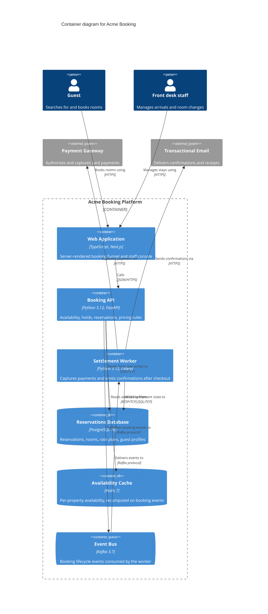

## Summary

The containers that make up the Acme Booking platform, the technology each one
runs on, and how they talk to each other. This is C4 level 2 — it stops at
deployable units and does not open any of them up.

**This is an illustrative example system, not a real client architecture.**

## Diagram



## Notes

- **Holds are not reservations.** The API writes a short-lived hold row before
  payment authorization; the worker promotes it to a reservation only after
  capture succeeds. Anything that reads reservations must ignore holds.
- **The cache is derived, never authoritative.** It is rebuilt from booking
  events, so a cold Redis costs latency but cannot lose a booking.
- Deliberately omitted at this level: the read replica behind the reporting
  path, and the CDN in front of the web application. Both belong on a
  deployment diagram rather than a container diagram.

## Related levels

Other diagrams for this system share `subject_system: acme-booking`, so the
whole C4 set can be found with:

```bash
rg -l 'subject_system: acme-booking' kb/
```
