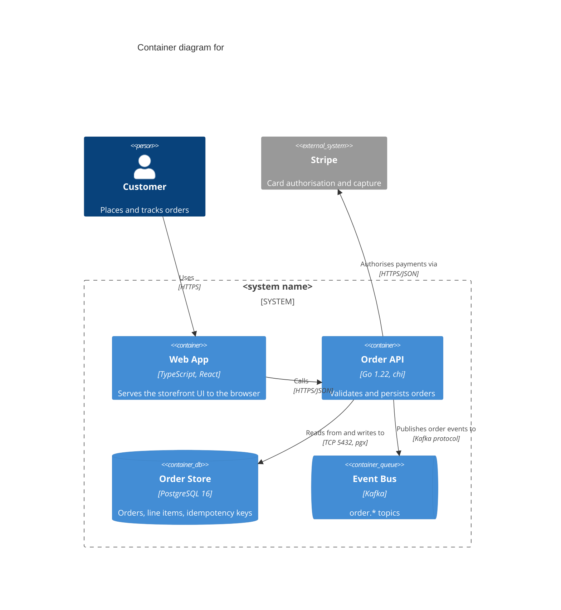

## Summary

This prompt turns a repository into a C4 level-2 container diagram. Its whole
job is to stop the model doing the thing it does by default, which is to draw
the source tree: one box per top-level folder, one box per class it found
interesting, and arrows that mean "imports". The prompt does that by defining
*container* explicitly, demanding a file-path citation for every box and every
arrow, and giving the model somewhere to put its uncertainty other than the
diagram. Good output is a Mermaid `C4Container` block whose boxes map one-to-one
onto things you could point at in a deployment, plus an evidence table you can
spot-check in about two minutes.

## Prompt

````text
You are producing a C4 model **level 2 (Container) diagram** for the repository
I have given you access to. Read the repository before you write anything.

## What a container is, for this task

A container is a **separately deployable or runnable unit that executes code or
stores data**. Examples: a web server process, a single-page app shipped to the
browser, a mobile app, a serverless function, a scheduled job, a database, a
message broker, an object-storage bucket, a cache.

A container is **not**: a class, a module, a package, a layer, a source folder,
a shared library, a git submodule, a namespace, or a design pattern. If two
things always deploy together in the same process, they are ONE container. If
you find yourself drawing "Service Layer" or "Utils" or "Domain", you have
dropped to level 3 and you must go back up.

Scope: exactly one software system. Everything the system talks to but does not
deploy (third-party APIs, corporate SSO, another team's service) is an external
system, drawn outside the system boundary, never decomposed.

## How to find the containers - evidence, in this order of authority

1. Deployment descriptors: Dockerfiles, `docker-compose.y*ml` services,
   Kubernetes Deployment/StatefulSet/CronJob manifests, Helm charts,
   `serverless.yml`, `Procfile`, `fly.toml`, `app.yaml`, Terraform resources
   for compute and data stores.
2. CI/CD: what the pipeline builds, publishes and deploys as separate units.
3. Process entrypoints: `main()`, `if __name__ == "__main__"`, `bin/` scripts,
   `scripts.start` in `package.json`, workspace/monorepo package manifests that
   produce a runnable artifact.
4. Datastore and broker configuration: connection strings, ORM/migration config,
   client construction for Postgres, Redis, Kafka, S3, and similar.
5. Only if 1-4 are silent: README and docs prose, clearly marked as weaker
   evidence.

Every container you draw must trace to at least one concrete file path. If it
does not, it is not a container - move it to the Unresolved list.

## How to find the relationships

Draw a relationship only where there is evidence of a **runtime** interaction:
an HTTP client pointed at another container's URL or service name, a queue
publish or subscribe, a database client, a gRPC stub, a scheduled invocation.
An `import` or a shared type package is not a relationship at this level.

Every relationship needs a direction (who initiates), a verb phrase describing
intent ("Publishes order events to"), and the technology/protocol
("HTTPS/JSON", "gRPC", "AMQP", "TCP 5432", "S3 API"). If you cannot name the
protocol, say `unknown protocol` - do not guess `HTTPS` as a filler.

## Output - exactly these three sections, in this order

### 1. Diagram

A single fenced ```mermaid block using Mermaid's C4 syntax:



Rules for the block:
- Use `Container`, `ContainerDb`, `ContainerQueue`, `Person`, `System_Ext`,
  `System_Boundary`. Do not use `Component` - that is level 3.
- Every `Container(...)` takes four arguments: id, name, technology, description.
  Fill the technology argument with the actual language/framework/version you
  found, not a category word.
- Ids are short, lowercase, and unique. Names are what a human calls the thing.
- Aim for 4-12 containers. If you have more than 15, you have almost certainly
  decomposed a monolith into modules - re-read the deployment descriptors.
- No styling directives, no `UpdateRelStyle`, no colours.

### 2. Evidence table

One row per container and per relationship:

| Element | Kind | Evidence (path:line or path) | Confidence |
|---|---|---|---|

Confidence is `high` (deployment descriptor or entrypoint), `medium` (inferred
from client configuration), or `low` (prose only).

### 3. Unresolved

A bullet list of what you could not determine, phrased as questions a maintainer
could answer in one line each. Examples: "Is `worker/` deployed as its own
process or run in-process by the API?", "Is Redis a cache or the session store
of record?". An empty list here is a red flag - say so if you genuinely have
none.

## Hard constraints

- Do not invent containers to make the diagram look complete. A three-box
  diagram that is true beats an eight-box diagram that is plausible.
- Do not include anything from the repository's own build tooling (linters,
  test runners, CI images) as a container.
- If the repository contains several independent systems, stop and ask me which
  one to diagram instead of merging them.
- Do not describe your process, apologise, or summarise the codebase. Output the
  three sections and nothing else.
````

## When to use it

- Onboarding onto an unfamiliar service and wanting a map you can falsify,
  rather than a wiki diagram that was last true two years ago.
- Producing the first draft of an architecture document, where the value is in
  the Unresolved list forcing the right five questions to the surface.
- Auditing drift: run it against `main`, diff the container list against the
  committed diagram, and treat differences as findings.
- Pre-work for a threat model or a dependency review, where "what deploys
  separately" is exactly the boundary you care about.

It is a poor fit for a single library or SDK repository, which has no containers
at all, and for a monorepo containing several unrelated systems, where the
prompt will (deliberately) stop and ask.

## Known failure modes

**Source tree cosplay.** The dominant failure. The model emits one container per
top-level directory, so `internal/`, `pkg/` and `cmd/` become peers. The
container definition and the "if two things deploy together they are one
container" line are there to suppress it; the evidence table is how you catch it
when they do not. If you see a container whose only evidence is a directory
path, delete it.

**Level-3 leakage.** Boxes named "Repository", "Handler", "Service Layer".
Usually triggered when deployment descriptors are missing, so the model reaches
for the only structure it can see. Fix by supplying the deployment manifests
explicitly, or by telling it up front that the system is a single deployable.

**Invented infrastructure.** Redis, an API gateway and a load balancer appear
because the model has seen a thousand diagrams containing them. They will have
`low` confidence or no evidence row at all. This is the single highest-value
column in the evidence table.

**Mermaid C4 rendering.** Mermaid's C4 support is still marked experimental and
its layout engine ignores most positioning; wide diagrams come out cramped and
`UpdateRelStyle` behaves inconsistently across versions, which is why the prompt
bans it. If your renderer does not support `C4Container` at all, ask for a
`flowchart LR` with `subgraph` for the system boundary and edge labels in the
form `-- "Calls (HTTPS/JSON)" -->`. The semantics survive; only the notation is
lost.

**Syntax errors in the fence.** Common ones: a comma inside a quoted description
argument, a missing fourth argument to `Container(...)`, an unbalanced
`System_Boundary` brace, and `Rel` referring to an id that was never declared.
Always render the output before circulating it.

**Silent truncation on large repositories.** On a repo with hundreds of
manifests, the model stops reading and diagrams what it saw first, with no
signal that it did. Constrain the search yourself: point it at
`deploy/`, `infra/`, `charts/` and the workspace manifest, or run it per
bounded context and stitch the results.

**Stale confidence.** The evidence is a snapshot of one commit. Record the
commit SHA next to the diagram, or the artifact starts rotting the moment a
service is split.
