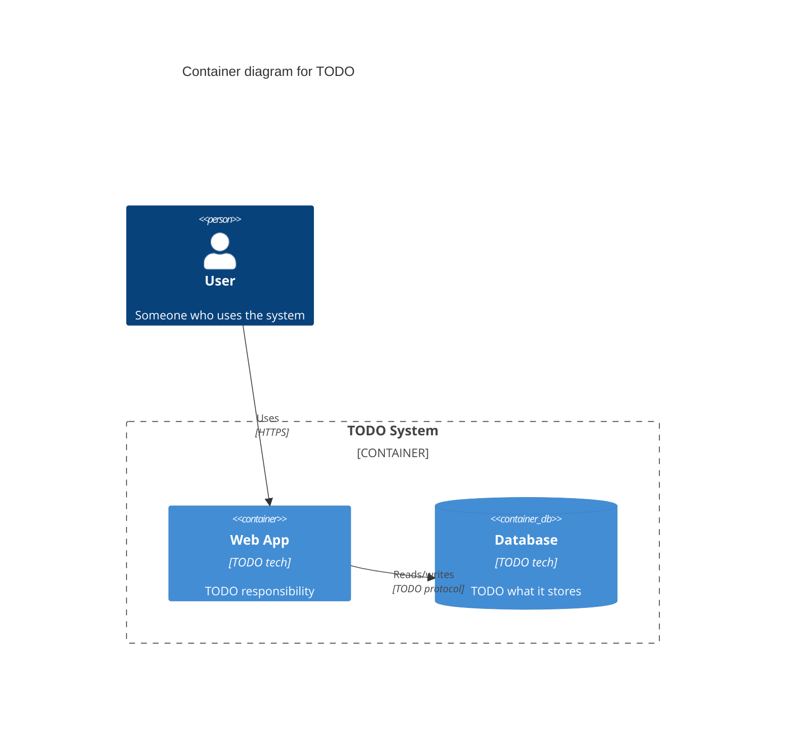

## Summary

TODO: what this diagram shows and when to look at it.

## Diagram

## Notes

TODO: anything the diagram cannot say for itself - constraints, things
deliberately omitted, decisions still open.

<!--
`diagram_kind` values: c4, sequence, er, flowchart, state, class, architecture.
`c4_level` and `subject_system` are required only when diagram_kind is c4.
For a C4 set, use the same `subject_system` slug across every level so the
levels can be found together:  rg -l 'subject_system: your-system' kb/
-->
